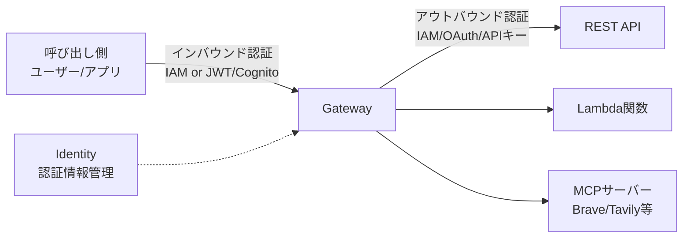

## デプロイに必要な最低リソース

#### 1. IAMロール (AgentRuntimeRole)
- **目的**: AgentCore Runtimeでの実行権限
- **必須ポリシー**:
  - Bedrock model invoke
  - CloudWatch Logs書き込み
  - ECRイメージ取得
  - 必要に応じてS3、DynamoDBなど

#### 2. Amazon ECR リポジトリ
- **作成方法**: `aws ecr create-repository`
- **アーキテクチャ**: ARM64必須
- **管理**: イメージのビルド・プッシュは手動

#### 3. Agent Runtime
- **作成方法**: `create_agent_runtime` API
- **必須設定**:
  - エージェントランタイム名
  - コンテナURI（ECRから）
  - ネットワーク設定（PUBLIC/PRIVATE）
  - IAMロールARN

#### 4. ネットワーク設定（PRIVATEの場合）
- VPC
- サブネット
- セキュリティグループ
- VPCエンドポイント（Bedrock用）

## 各種リソース

### Agent Runtime
**= AIエージェント用のLambda的なサーバーレス実行環境**

エージェントのコードを動かすためのコンテナ実行環境。ECRにプッシュしたDockerイメージを指定して作成し、LangGraphやCrewAIなどで書いたエージェントコードを実行できる。Lambdaと同じように自動スケーリングし、インフラ管理が不要。

### Memory
**= エージェントが使える記憶領域（短期・長期）**

エージェントが会話や過去の情報を覚えておくためのストレージ。短期メモリは1つの会話セッション内での記憶、長期メモリは複数のエージェント間で共有できる永続的な記憶。DynamoDBやRDSのような感覚で、エージェントがデータを保存・取得できる。

### Code Interpreter
**= コード実行用のサンドボックス環境**

エージェントがPythonなどのコードを動的に実行できる隔離された実行環境。エージェントが「このデータを分析して」と言われたときに、その場でコードを書いて実行できる。セキュリティのために完全に隔離されたサンドボックス内で動作する。

### Browser
**= エージェント専用のヘッドレスブラウザ環境**

エージェントがウェブサイトにアクセスしたり操作したりするためのクラウドベースのブラウザ。PuppeteerやPlaywrightのような感覚で、エージェントがWebページの情報を取得したり、フォームを操作したりできる。

### Gateway
**= 既存APIやMCPサーバーをエージェント用ツールに変換するアダプター**

既存のREST API、Lambda関数、MCPサーバーなどを、エージェントが使える標準的なツールとして公開する仕組み。「MCPサーバーのマネージドサービス」として、複数のMCPサーバー（Brave、Tavilyなど）を統合し、エージェントから簡単に利用できるようにする。

エージェントは「このツールを使いたい」と言うだけで、背後のAPI/MCPサーバーを自動的に呼び出せる。Identity機能と統合することで、APIキーなどの認証情報も安全に管理できる。

**認証の仕組み:**
- **インバウンド認証**: 誰がGatewayを呼び出せるか（IAM or JWT/Cognito）
- **アウトバウンド認証**: Gatewayがどうやって外部API/MCPサーバーにアクセスするか（IAM/OAuth/APIキー）(APIキー等はIdentityで登録されているものを選択する形。)

Cognitoは、JWTベースのインバウンド認証を使う場合に、エージェント呼び出し側のユーザー認証を管理するために使用される。

参考: https://zenn.dev/aws_japan/articles/1b29bc6b8de3ca

### Identity (Credential Provider)
**= エージェント用の認証情報管理サービス**

エージェントが外部サービスにアクセスする際の認証情報を安全に管理する仕組み。Secrets Managerのような感覚で、以下の認証方式をサポート:
- **OAuth2**: OAuth2フローでの認証
- **API Key**: APIキーベースの認証
- **Workload Provider**: AWSワークロードアイデンティティでの認証

### Observability
**= エージェントの動作を監視・デバッグする仕組み**

エージェントの実行状況をトレースし、パフォーマンスを監視するための機能。CloudWatch LogsやX-Rayのような感覚で、OpenTelemetry形式のテレメトリデータを収集し、エージェントの動作を可視化できる。

