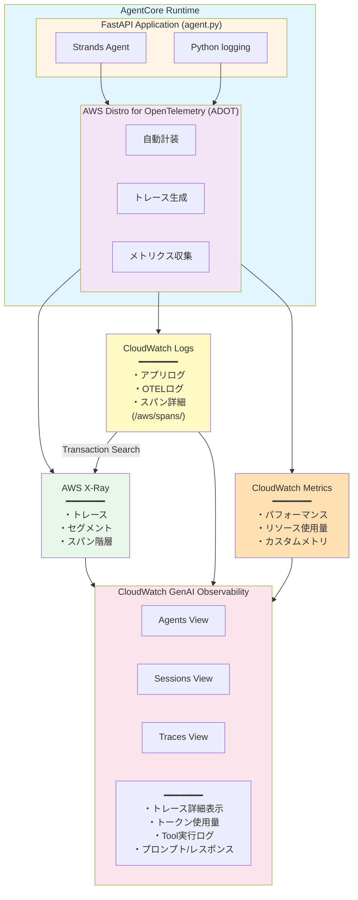

# AgentCore Observability アーキテクチャ全体像

## 目次
1. [各コンポーネントの説明](#各コンポーネントの説明)
2. [データフローとアーキテクチャ](#データフローとアーキテクチャ)
3. [AgentCore Observabilityが参照するデータ](#agentcore-observabilityが参照するデータ)
4. [現在のプロジェクトの状態](#現在のプロジェクトの状態)

---

## 各コンポーネントの説明

### 1. OpenTelemetry (OTEL)

**概要:**
- オープンソースの可観測性フレームワーク
- トレース、メトリクス、ログを統一的に収集
- ベンダーニュートラル（特定のクラウドに依存しない）

**役割:**
- アプリケーションコードを自動計装
- トレース（スパン）、メトリクス、ログの生成
- 複数のバックエンド（X-Ray, CloudWatch, Datadog等）にデータをエクスポート

**AWS Distro for OpenTelemetry (ADOT):**
- AWS公式のOpenTelemetryディストリビューション
- X-RayやCloudWatchとの統合が最適化されている
- IAM認証の自動処理

**主要な環境変数:**
```bash
OTEL_PYTHON_DISTRO=aws_distro                      # ADOT使用
OTEL_PYTHON_CONFIGURATOR=aws_configurator          # AWS設定
OTEL_TRACES_EXPORTER=otlp                          # OTLP形式でエクスポート
OTEL_EXPORTER_OTLP_PROTOCOL=http/protobuf          # HTTP/Protobuf形式
OTEL_RESOURCE_ATTRIBUTES=service.name=my-agent,aws.log.group.names=/aws/...
```

---

### 2. AWS X-Ray

**概要:**
- AWSマネージドの分散トレーシングサービス
- マイクロサービスアーキテクチャの可視化

**保存するデータ:**
- **トレース（Trace）:** リクエスト全体の実行フロー
- **セグメント（Segment）:** サービス単位の処理
- **サブセグメント（Subsegment）:** サービス内の細かい処理単位
- **メタデータ:** 実行時間、HTTPステータス、エラー情報
- **アノテーション:** フィルタ可能なキーバリュー
- **スパンイベント:** プロンプト/レスポンスの詳細（オプション）

**データ保存先:**
- X-Ray API（デフォルト）
- CloudWatch Logs `/aws/spans/default`（Transaction Search有効時）

**特徴:**
- サービスマップの自動生成
- レイテンシ分析
- エラー追跡
- 依存関係の可視化

**2027年の重要な変更:**
- 2027年2月25日にX-Ray SDKとDaemonのサポート終了
- OpenTelemetryへの完全移行を推奨

---

### 3. CloudWatch Logs

**概要:**
- AWSマネージドのログ集約・検索サービス
- リアルタイムログ監視とアーカイブ

**AgentCore関連のログループ:**

1. **Runtimeログ:**
   ```
   /aws/bedrock-agentcore/runtimes/<runtime-id>-<endpoint-qualifier>
   ```
   - アプリケーションログ（Python標準ログ）
   - Uvicornアクセスログ
   - OpenTelemetryログ（設定が正しければ）

2. **スパンログ:**
   ```
   /aws/spans/default
   ```
   - X-Rayトレースの詳細データ
   - CloudWatch Transaction Search用

3. **その他のリソースログ:**
   ```
   /aws/bedrock-agentcore/code-interpreter/*
   /aws/bedrock-agentcore/browser/*
   /aws/vendedlogs/bedrock-agentcore/*
   ```

**ログストリーム命名規則:**
```
2025/10/25/[runtime-logs]<UUID>
```
- 日付プレフィックス
- 用途識別子（`[runtime-logs]`）
- UUID（動的生成）

---

### 4. CloudWatch Metrics

**概要:**
- システムメトリクスとカスタムメトリクスの保存・可視化

**AgentCore関連のネームスペース:**
```
bedrock-agentcore
```

**収集されるメトリクス:**
- Runtime実行時間
- リクエスト数
- エラー率
- Tool実行回数
- Memory操作回数

**特徴:**
- リアルタイムダッシュボード
- アラーム設定可能
- 最大15ヶ月保存

---

### 5. CloudWatch GenAI Observability

**概要:**
- 生成AIアプリケーション専用の可観測性ダッシュボード
- 2025年AWS Summit NYC で発表
- Preview段階（2025年10月時点）

**提供する3つのビュー:**

1. **Agents View:**
   - 全エージェントの一覧
   - Runtime有無の表示
   - エージェント別のメトリクス

2. **Sessions View:**
   - セッション単位の追跡
   - 会話履歴の可視化
   - ユーザーインタラクション分析

3. **Traces View:**
   - トレース詳細の表示
   - スパン階層構造の可視化
   - タイムライン分析

**表示される主要データ:**
- モデル呼び出し詳細
- トークン使用量（input/output/total）
- Tool実行ログ
- レイテンシ分析
- エラートレース
- プロンプト/レスポンス内容（イベントデータとして）

**アクセス方法:**
```
AWS Console → CloudWatch → GenAI Observability → Bedrock AgentCore タブ
```

**価格:**
- AgentCore サービス自体は2025年9月16日まで無料
- CloudWatch使用料は通常通り課金

---

### 6. AgentCore Observability

**概要:**
- Bedrock AgentCoreに組み込まれた可観測性機能
- OpenTelemetry準拠の自動計装

**提供機能:**

1. **自動計装:**
   - Runtime上のエージェントは自動的にOpenTelemetryで計装される
   - 手動設定不要（Runtime使用時）

2. **統合サポート:**
   - Strands Agents
   - LangGraph
   - CrewAI
   - その他OTEL互換フレームワーク

3. **外部Observabilityツール連携:**
   - Dynatrace
   - Datadog
   - Arize Phoenix
   - LangSmith
   - Langfuse

**設定要件（Runtime外でホストする場合）:**
```bash
AGENT_OBSERVABILITY_ENABLED=true
OTEL_PYTHON_DISTRO=aws_distro
OTEL_EXPORTER_OTLP_PROTOCOL=http/protobuf
OTEL_TRACES_EXPORTER=otlp
```

**有効化の前提条件:**
1. CloudWatch Transaction Searchの有効化
2. X-Rayの権限設定
3. トレースセグメント送信先の設定（CloudWatch Logs）

---

## データフローとアーキテクチャ

### 全体アーキテクチャ図



### データ種類別のフロー

#### 1. トレース（Traces）データ

```
Strands Agent実行
  ↓
OpenTelemetry Span生成
  ↓
AWS X-Ray Exporter
  ↓
├─→ X-Ray API（トレース構造）
│
└─→ CloudWatch Logs /aws/spans/default（詳細データ）
     ↓
     CloudWatch Transaction Search（インデックス化）
     ↓
     GenAI Observability（可視化）
```

**含まれる情報:**
- スパンID、トレースID
- 親子関係
- タイムスタンプ（開始/終了）
- レイテンシ
- HTTPステータス
- エラー情報
- カスタム属性（attributes）
- **イベント（events）**: プロンプト/レスポンスの詳細

#### 2. ログ（Logs）データ

```
Python logging.info()
  ↓
stdout（コンテナ標準出力）
  ↓
CloudWatch Logs /aws/bedrock-agentcore/runtimes/<id>-DEFAULT
  ↓
GenAI Observability（ログ表示）


OpenTelemetry Logs（※現在エラー中）
  ↓
OTEL Logs Exporter
  ↓
CloudWatch Logs /aws/bedrock-agentcore/runtimes/<id>-DEFAULT
  （本来ここに出力されるべき）
```

**含まれる情報:**
- ログレベル（INFO, ERROR, etc.）
- タイムスタンプ
- メッセージ本文
- トレースコンテキスト（span_id, trace_id）

#### 3. メトリクス（Metrics）データ

```
Runtime実行
  ↓
OpenTelemetry Metrics
  ↓
CloudWatch Metrics (bedrock-agentcore namespace)
  ↓
GenAI Observability（メトリクス表示）
```

**含まれる情報:**
- リクエスト数
- 実行時間
- エラー率
- Tool呼び出し回数
- Memory操作回数

---

## AgentCore Observabilityが参照するデータ

### データソースと優先順位

CloudWatch GenAI ObservabilityのBedrock AgentCoreタブは、以下のデータソースを参照します：

1. **主要データソース: CloudWatch Transaction Search**
   - `/aws/spans/default` のスパンデータをインデックス化
   - X-Rayトレースと統合
   - リアルタイムクエリ可能

2. **補助データソース: X-Ray API**
   - サービスマップ
   - トレース検索
   - 統計情報

3. **ログデータ: CloudWatch Logs**
   - アプリケーションログの表示
   - エラーログの関連付け
   - デバッグ情報

4. **メトリクスデータ: CloudWatch Metrics**
   - パフォーマンスグラフ
   - リソース使用量
   - カスタムメトリクス

### 各ビューが参照するデータ

#### Agents View
```
データソース:
- CloudWatch Metrics (bedrock-agentcore namespace)
- CloudWatch Logs (Runtime状態確認)
- Transaction Search (実行統計)

表示内容:
- エージェント一覧
- Runtime有無
- 実行回数、エラー率
- 平均レイテンシ
```

#### Sessions View
```
データソース:
- Transaction Search (session_id でフィルタ)
- X-Ray トレース
- CloudWatch Logs (会話ログ)

表示内容:
- セッション一覧
- セッション時間
- リクエスト数
- 関連トレース
```

#### Traces View
```
データソース:
- X-Ray トレース（スパン構造）
- /aws/spans/default（スパン詳細）
- Transaction Search（クエリ）

表示内容:
- トレース階層構造
- 各スパンのタイミング
- 属性（attributes）
- イベント（events）← プロンプト/レスポンスはここ
- エラー詳細
```

---

## 現在のプロジェクトの状態

### ✅ 正常に動作している部分

#### 1. X-Rayトレース
- **状態:** 完全に動作
- **データ:** スパン構造、タイミング、メタデータ
- **確認コマンド:**
  ```bash
  aws xray get-trace-summaries --start-time <timestamp> --end-time <timestamp>
  aws xray batch-get-traces --trace-ids <trace-id>
  ```

**収集できているデータ:**
- Agent実行フロー
- Bedrock API呼び出し（ConverseStream）
- Memory API呼び出し（ListEvents, CreateEvent）
- トークン使用量（`gen_ai.usage.*`）
- レイテンシ情報

#### 2. Python標準ログ
- **状態:** 正常出力
- **ロケーション:** `/aws/bedrock-agentcore/runtimes/<id>-DEFAULT`
- **内容:**
  - Uvicornサーバーログ
  - アプリケーションログ（`logger.info()`）
  - HTTPリクエストログ

#### 3. CloudWatch Metrics
- **状態:** 自動収集（推測）
- **ネームスペース:** `bedrock-agentcore`
- **メトリクス:** Runtime実行統計

---

### ⚠️ 警告が出ている部分

#### 1. OpenTelemetryログエクスポート設定の警告

**現在の状態:**
- ✅ 400エラー（ログストリーム名の不一致）は解消済み
- ✅ 403エラー（認証エラー）も解消済み
- ⚠️ 起動時に2つの設定警告メッセージが表示される

**警告メッセージ:**
```
Improper configuration: Please configure the environment variable OTEL_EXPORTER_OTLP_LOGS_HEADERS to have values for x-aws-log-group and x-aws-log-stream

Improper configuration: please export/set OTEL_EXPORTER_OTLP_LOGS_PROTOCOL=http/protobuf and OTEL_LOGS_EXPORTER=otlp
```

**原因:**
- OpenTelemetryのログエクスポーターが推奨設定を求めている
- 現在は `x-aws-log-stream` を指定せず、動的生成に任せている
- `OTEL_EXPORTER_OTLP_LOGS_PROTOCOL` と `OTEL_LOGS_EXPORTER` の設定が求められている

**影響:**
- ⚠️ 警告メッセージが出るが、実害はない
- ✅ X-Rayトレースは正常に動作
- ✅ Python標準ログも正常に出力
- ✅ サーバーは正常起動

**備考:**
- これらは警告であり、エラーではない
- OpenTelemetryの詳細ログがCloudWatch Logsに記録されない可能性はあるが、トレースとメトリクスは正常に動作している

#### 2. スパンイベント（Span Events）の欠如

**症状:**
- GenAI Observabilityで「イベントはありません」と表示
- プロンプト/レスポンスの内容が見えない

**原因:**
- Strands AgentのOpenTelemetry計装がイベントを記録していない
- または、イベント記録がデフォルトで無効化されている

**参考記事との差異:**
参考記事（https://dev.classmethod.jp/articles/amazon-bedrock-agentcore-observability-genai-observability/）
では、プロンプト/レスポンスの詳細が表示されていますが、これは：
- Bedrock Agents（マネージドサービス）は自動的に詳細計装
- カスタムランタイムは手動での追加計装が必要

**影響:**
- エージェントの思考プロセスが見えない
- ユーザーとのやり取りの詳細が不明
- デバッグ困難

---

### 問題の優先順位と影響度

| 問題 | 影響度 | 可観測性への影響 | 修正難易度 | 状態 |
|------|--------|-----------------|-----------|------|
| スパンイベント欠如 | 🔴 高 | プロンプト/レスポンスが見えない | 中 | 未解決 |
| OTEL設定警告 | 🟢 低 | 警告のみ（実害なし） | 低 | 警告のみ |
| ~~OTELログ400エラー~~ | - | - | - | ✅ 解消済み |
| ~~OTELログ403エラー~~ | - | - | - | ✅ 解消済み |

---

## 推奨される修正手順

### ✅ 完了済み: エラーの解消

以下の問題は解決済みです：

**Phase 1（完了）: 403エラーの解消**
- 汎用HTTPエクスポーターに関する認証エラーが自然解消

**Phase 2（完了）: 400エラーの解消**
- `x-aws-log-stream` 指定を削除し、動的ログストリーム名生成に任せることで解決
- 現在の設定:
```hcl
OTEL_EXPORTER_OTLP_LOGS_HEADERS = var.agent_runtime_id != "" ?
  "x-aws-log-group=/aws/bedrock-agentcore/runtimes/${var.agent_runtime_id}-${var.agent_runtime_endpoint_qualifier},x-aws-metric-namespace=bedrock-agentcore"
  : "x-aws-metric-namespace=bedrock-agentcore"
```

---

### 現在の主要課題: スパンイベントの追加（優先度: 高）

**方法1: 環境変数での有効化（要調査）**
Strands AgentやOpenTelemetryの計装レベルを上げる環境変数があるか調査

**方法2: カスタム計装を追加**
`agent.py` に明示的なイベント記録を追加：

```python
from opentelemetry import trace

tracer = trace.get_tracer(__name__)

@app.post("/invocations")
def invoke(request: InvocationRequest) -> InvocationResponse:
    with tracer.start_as_current_span("agent_invocation") as span:
        prompt = request.input.get("prompt", "")

        # プロンプトをイベントとして記録
        span.add_event(
            "gen_ai.prompt",
            attributes={"gen_ai.prompt": prompt}
        )

        current_agent = create_agent(...)
        response = current_agent(prompt)
        response_text = str(response)

        # レスポンスをイベントとして記録
        span.add_event(
            "gen_ai.completion",
            attributes={"gen_ai.completion": response_text}
        )

        return InvocationResponse(...)
```

---

## 参考リソース

### 公式ドキュメント
- [AgentCore Observability設定](https://docs.aws.amazon.com/bedrock-agentcore/latest/devguide/observability-configure.html)
- [AgentCore Observability入門](https://docs.aws.amazon.com/bedrock-agentcore/latest/devguide/observability-get-started.html)
- [X-Ray OpenTelemetry移行ガイド](https://docs.aws.amazon.com/xray/latest/devguide/xray-sdk-migration.html)

### ブログ記事
- [Build trustworthy AI agents with Amazon Bedrock AgentCore Observability](https://aws.amazon.com/blogs/machine-learning/build-trustworthy-ai-agents-with-amazon-bedrock-agentcore-observability/)
- [Launching Amazon CloudWatch generative AI observability (Preview)](https://aws.amazon.com/blogs/mt/launching-amazon-cloudwatch-generative-ai-observability-preview/)
- [クラスメソッド: Amazon Bedrock AgentCore Observability](https://dev.classmethod.jp/articles/amazon-bedrock-agentcore-observability-genai-observability/)

### 重要な期限
- **2025年9月16日:** AgentCore無料期間終了
- **2027年2月25日:** X-Ray SDK/Daemonサポート終了（OpenTelemetryへ完全移行）

---

## まとめ

### 全体像のポイント

1. **OpenTelemetryが中心**
   - すべての可観測性データはOTELから生成される
   - AWS ADOTがAWSサービスとの統合を提供

2. **3つのデータタイプ**
   - トレース → X-Ray + CloudWatch Logs
   - ログ → CloudWatch Logs
   - メトリクス → CloudWatch Metrics

3. **GenAI Observabilityは統合ビュー**
   - 上記すべてのデータソースを統合
   - AI特化の可視化とクエリ
   - Transaction Searchが基盤

4. **現在の状態（2025-10-25時点）**
   - ✅ トレース構造は完璧
   - ✅ 基本ログは正常動作
   - ✅ 400/403エラーは解消済み
   - ⚠️ OpenTelemetry設定警告あり（実害なし）
   - ❌ プロンプト/レスポンス詳細が欠如（計装不足）

### 次のアクション

1. **最優先（可観測性向上）:**
   - スパンイベント追加（カスタム計装）
   - プロンプト/レスポンス内容の可視化

2. **オプション（警告解消）:**
   - OpenTelemetry設定の最適化
   - 環境変数の調整

3. **長期（運用改善）:**
   - ダッシュボードの構築
   - アラート設定
   - パフォーマンス最適化
