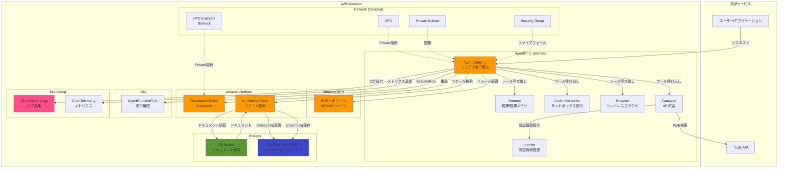
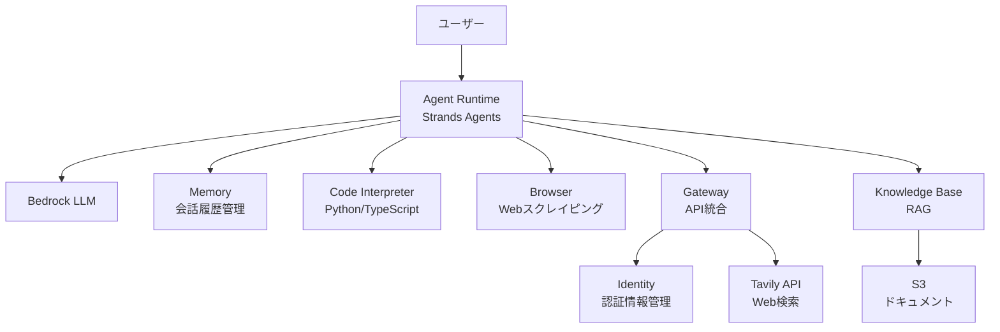
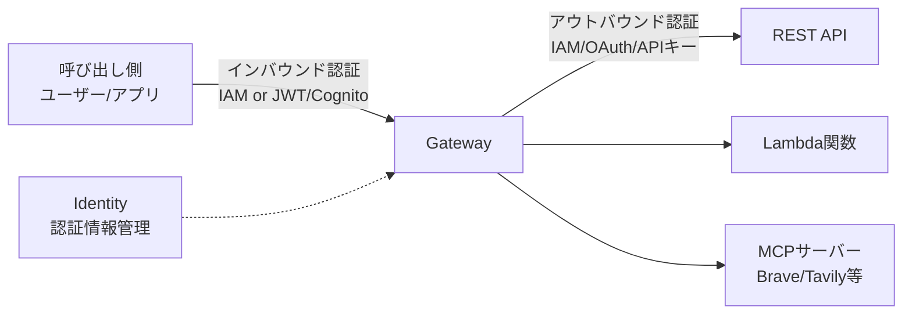
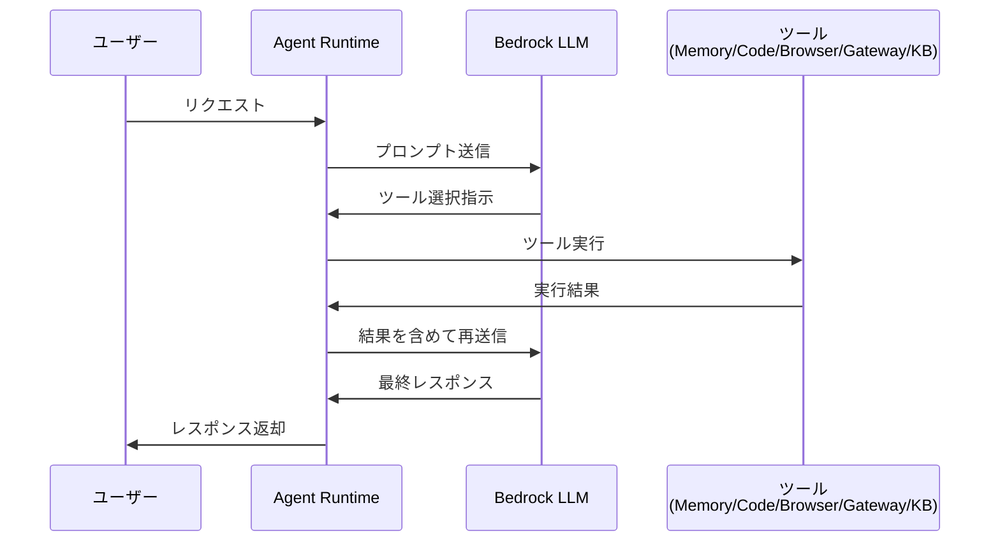
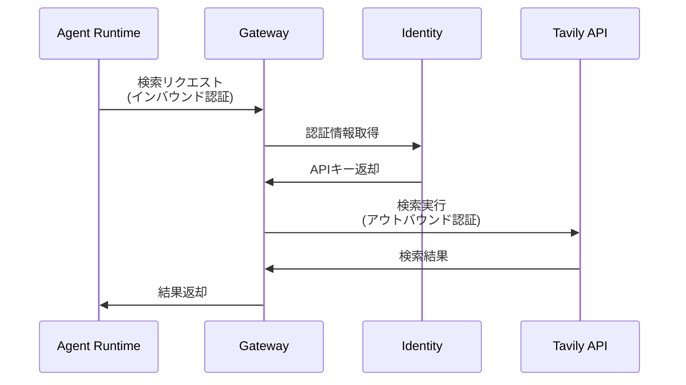
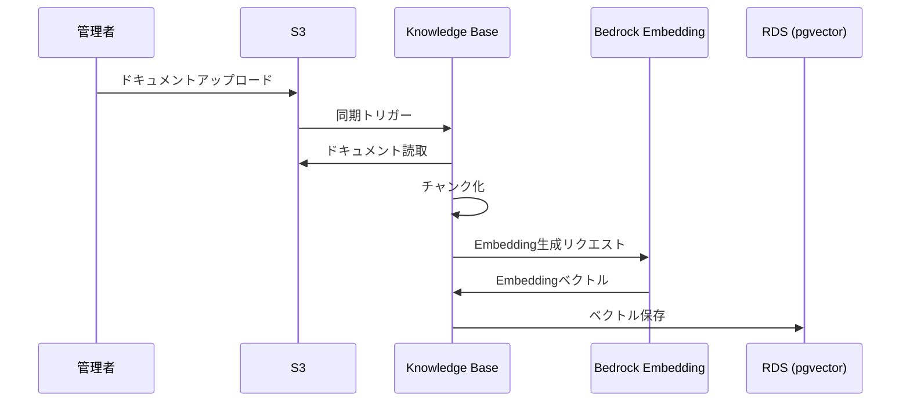
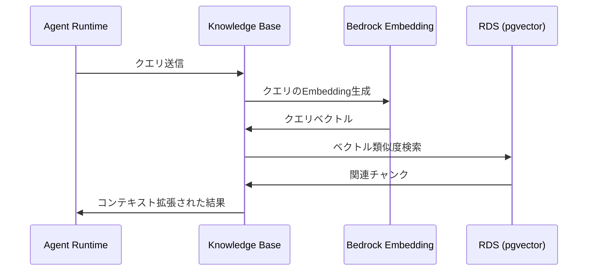

# AgentCore ハンズオン設計書

## 1. 概要
AgentCoreを使用したAIエージェントシステムの構築。Strands Agentsフレームワークをベースに、Web検索・コード実行・RAG機能を持つエージェントをデプロイする。

## 2. アーキテクチャ

### 2.1 AWS構成図

### 2.2 コンポーネント関係図

## 3. コンポーネント設計

### 3.1 Agent Runtime
- **フレームワーク**: Strands Agents
- **デプロイ方法**: ECRコンテナイメージ（ARM64）
- **実行環境**: サーバーレス自動スケーリング
- **必須IAMロール**: AgentRuntimeRole
  - Bedrock model invoke
  - CloudWatch Logs書き込み
  - ECRイメージ取得

### 3.2 Memory
- **短期メモリ**: セッション内コンテキスト管理
- **長期メモリ**: エージェント間で共有可能な永続ストレージ
- **用途**: 会話履歴、エージェント状態の保存

### 3.3 Code Interpreter
- **Python実行環境**: データ分析・処理タスク
- **TypeScript実行環境**: JavaScript操作
- **セキュリティ**: サンドボックス隔離環境

### 3.4 Browser
- **機能**: ヘッドレスブラウザ
- **用途**: Webスクレイピング、ページ操作、情報抽出

### 3.5 Gateway + Identity
- **Gateway**: REST API/MCPサーバーをエージェントツール化
- **Identity**: 認証情報管理（OAuth2/APIキー）
- **統合API**: Tavily（Web検索）
- **認証フロー**:
  - インバウンド: IAM or JWT/Cognito
  - アウトバウンド: IAM/OAuth/APIキー（Identityから取得）

### 3.6 RAG (Knowledge Base)
- **サービス**: Amazon Bedrock Knowledge Base
- **データソース**: S3バケット（元ドキュメント）
- **ベクトルストア**: RDS for PostgreSQL（pgvector）
- **検索方式**: ベクトル化による意味検索
- **フロー**:
  1. S3にドキュメントをアップロード
  2. Knowledge Baseがドキュメントをチャンク化
  3. BedrockでEmbedding生成
  4. RDS（pgvector）にベクトル保存
  5. クエリ時はRDSでベクトル検索
- **アクセス**: エージェントから直接クエリ

## 4. デプロイ要件

### 4.1 必須リソース
1. **IAMロール** (AgentRuntimeRole)
2. **ECRリポジトリ** (ARM64アーキテクチャ)
3. **Agent Runtime** (create_agent_runtime API)
4. **RDS for PostgreSQL** (pgvector拡張有効化)
5. **S3バケット** (Knowledge Baseドキュメント保存)
6. **ネットワーク設定** (PRIVATEの場合):
   - VPC
   - サブネット（RDS用とRuntime用）
   - セキュリティグループ
   - VPCエンドポイント（Bedrock用）

### 4.2 外部サービス
- **Tavily API**: Web検索機能（Gateway経由）
- **Amazon Bedrock**: LLMモデル
- **Amazon S3**: Knowledge Baseドキュメント保存

## 5. データフロー

### 5.1 基本フロー

### 5.2 Web検索フロー

### 5.3 RAGフロー（セットアップ）

### 5.4 RAGフロー（検索時）

## 6. セキュリティ

- **コード実行**: サンドボックス隔離
- **認証情報**: Identity（Secrets Manager相当）で管理
- **ネットワーク**: VPC内プライベート通信（オプション）
- **IAM**: 最小権限の原則

## 7. モニタリング

- **ログ**: CloudWatch Logs
- **トレース**: OpenTelemetry対応
- **メトリクス**: エージェント実行状況の可視化
