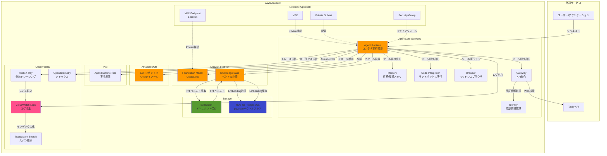
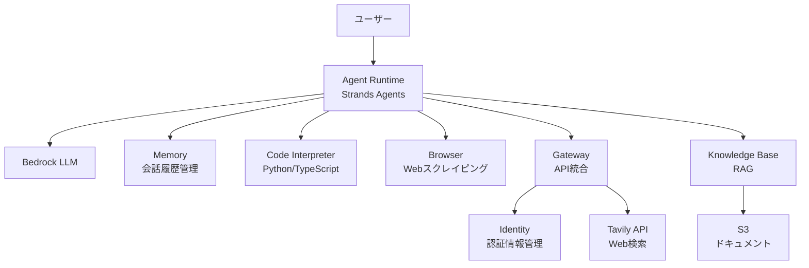
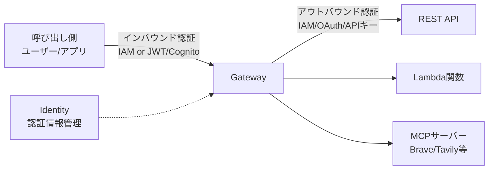
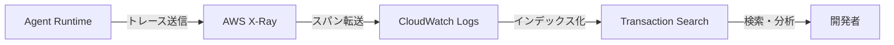

# AgentCore ハンズオン設計書

## 1. 概要
AgentCoreを使用したAIエージェントシステムの構築。Strands Agentsフレームワークをベースに、Web検索・コード実行・RAG機能を持つエージェントをデプロイする。

## 2. アーキテクチャ

### 2.1 AWS構成図

### 2.2 コンポーネント関係図

## 3. コンポーネント設計

### 3.1 Agent Runtime
- **フレームワーク**: Strands Agents
- **デプロイ方法**: ECRコンテナイメージ（ARM64）
- **実行環境**: サーバーレス自動スケーリング
- **必須IAMロール**: AgentRuntimeRole
  - Bedrock model invoke
  - CloudWatch Logs書き込み
  - ECRイメージ取得

### 3.2 Memory
- **短期メモリ**: セッション内コンテキスト管理
- **長期メモリ**: エージェント間で共有可能な永続ストレージ
- **用途**: 会話履歴、エージェント状態の保存

### 3.3 Code Interpreter
- **Python実行環境**: データ分析・処理タスク
- **TypeScript実行環境**: JavaScript操作
- **セキュリティ**: サンドボックス隔離環境

### 3.4 Browser
- **機能**: ヘッドレスブラウザ
- **用途**: Webスクレイピング、ページ操作、情報抽出

### 3.5 Gateway + Identity
- **Gateway**: REST API/MCPサーバーをエージェントツール化
- **Identity**: 認証情報管理（OAuth2/APIキー）
- **統合API**: Tavily（Web検索）
- **認証フロー**:
  - インバウンド: IAM or JWT/Cognito
  - アウトバウンド: IAM/OAuth/APIキー（Identityから取得）

### 3.6 RAG (Knowledge Base)
- **サービス**: Amazon Bedrock Knowledge Base
- **データソース**: S3バケット（元ドキュメント）
- **ベクトルストア**: RDS for PostgreSQL（pgvector）
- **検索方式**: ベクトル化による意味検索
- **フロー**:
  1. S3にドキュメントをアップロード
  2. Knowledge Baseがドキュメントをチャンク化
  3. BedrockでEmbedding生成
  4. RDS（pgvector）にベクトル保存
  5. クエリ時はRDSでベクトル検索
- **アクセス**: エージェントから直接クエリ

### 3.7 Observability
- **トレーシング**: AWS X-Ray による分散トレーシング
- **ログ収集**: CloudWatch Logs
- **スパン収集**: CloudWatch Transaction Search
- **メトリクス**: OpenTelemetry
- **可視化機能**:
  - エージェント実行フローの追跡
  - ツール呼び出しのトレース
  - LLM推論リクエスト/レスポンスの記録
  - パフォーマンスボトルネックの特定
  - エラー発生箇所の特定
- **設定要件**:
  - X-Ray トレースセグメント送信先を CloudWatch Logs に設定
  - CloudWatch Logs リソースポリシーで X-Ray からのアクセスを許可
  - エージェント実行時に自動的にトレースデータ収集
  - トレースサンプリング率の設定（オプション）

